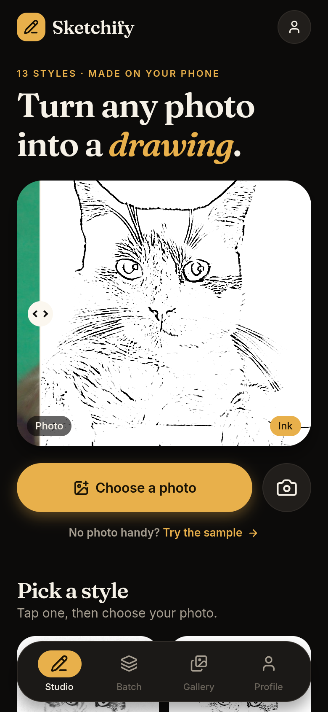
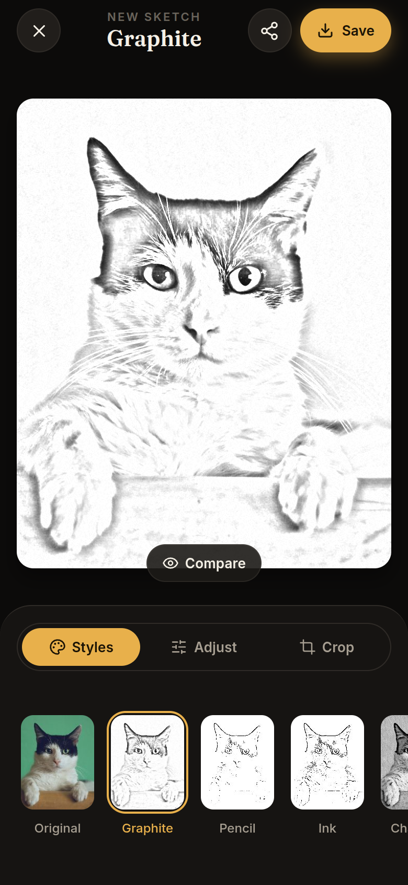
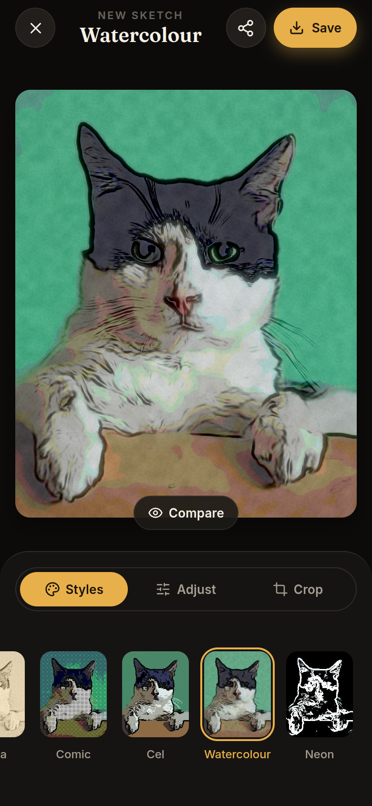
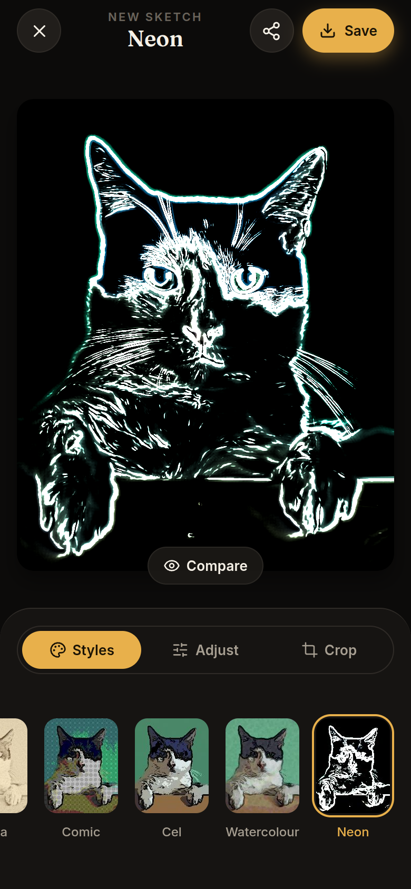
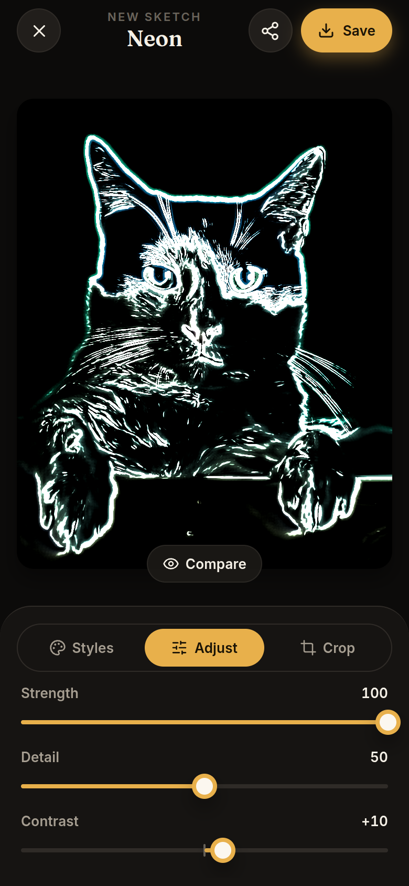
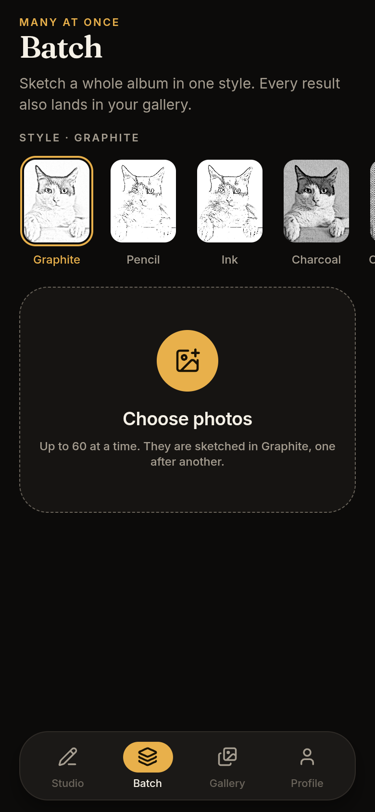

# Sketchify

[](https://github.com/twinstack-studio/sketchify/actions/workflows/ci.yml)
[](./LICENSE)
[](https://sketchify.twinstackstudio.com)
[](https://github.com/twinstack-studio/sketchify/releases/latest/download/sketchify.apk)

Sketchify is a mobile app that turns photos into drawings. Thirteen sketch
styles, from graphite and ink to watercolour and neon, run as GPU shaders on
the phone, so the preview updates live while the sliders move and no photo is
ever uploaded. Built with React Native and Expo for Android and iOS.

[**Open the live demo**](https://sketchify.twinstackstudio.com) ·
[**Download for Android**](https://github.com/twinstack-studio/sketchify/releases/latest/download/sketchify.apk) ·
[**Work with TwinStack Studio**](https://twinstackstudio.com/contact)

| | | |
| --- | --- | --- |
|  |  |  |
|  |  |  |

> **Note:** the live demo is a web preview of the mobile app. Try the sample
> photo, switch styles and move the sliders there; saving to Photos, sharing
> and the camera work only in the app. The Android APK is signed for direct
> installation, not the Play Store. The sample photo is from Unsplash.

## What the product delivers

### For users

- **Thirteen styles:** Graphite, Pencil, Ink, Charcoal, Cross-hatch, Stipple, Blueprint, Noir, Sepia, Comic, Cel, Watercolour and Neon, plus the original photo
- **Studio:** an animated before/after that cycles through the styles, a style grid with real previews, and recent sketches
- **Try the sample:** a bundled photo opens the editor straight away, before the user picks anything
- **Live editor:** your own photo in every style, six sliders (strength, detail, contrast, brightness, grain, warmth) with values, invert, and reset to defaults
- **Crop, rotate and flip,** and a Compare button to see the original
- **Batch:** sketch up to 60 photos in one style, then save them all or export one PDF
- **Gallery:** a two-column wall of saved sketches, favourites, and a long-press menu
- **Viewer:** a sketch full screen; swipe through, favourite, share, save, delete or edit again
- **Camera:** in-app camera with a style picker, photo-library shortcut and front/back switch
- **Export settings:** PNG, JPG or WebP, size up to 4096 px, optional watermark, save to Photos
- **Safe editing:** the app asks before throwing away unsaved changes
- **Optional cloud backup:** sign in to back sketches up; without it the app works fully offline

### Engineering highlights

- **GPU shaders:** every style is an SkSL shader run by Skia, so a full-resolution preview redraws as the sliders move
- **Private by design:** photos are processed on the phone; nothing is uploaded unless the user turns on backup
- **Fast style pickers:** style previews are rendered once, not as thirteen live shaders at the same time
- **Locked-down backup:** the Supabase table and storage bucket use row-level security, so each user can reach only their own sketches
- **Instant start:** settings and the library are stored in MMKV and load synchronously, so saved sketches are there the moment the app opens
- **Motion design:** spring press feedback, a floating tab bar, bottom sheets, toasts and haptics
- **Tested shaders:** a script compiles every shader with CanvasKit and renders a photo in each style, so a broken shader is caught before it reaches a phone

## Technology

| Layer | Stack |
| --- | --- |
| Framework | React Native 0.86, Expo SDK 57, expo-router |
| Graphics | @shopify/react-native-skia (SkSL shaders) |
| Animation | Reanimated 4, Gesture Handler |
| State | Zustand, persisted to MMKV |
| Cloud backup (optional) | Supabase auth, database and storage |
| Language | TypeScript, React Compiler |
| Platforms | Android, iOS, web preview |

## Project structure

```text
sketchify/
├── assets/           App icon, splash, sample photo and style previews
├── scripts/          Shader test renderer, style preview and icon generators
├── screenshots/      README screenshots
├── src/
│   ├── app/          Screens: studio, batch, gallery, profile, editor, viewer, camera, onboarding, sign-in
│   ├── components/   UI primitives, editor canvas and filter strip, before/after art
│   ├── lib/          Files, export, picking, sharing, PDF, haptics, Supabase client
│   ├── skia/         SkSL shaders, filter list, transforms, offscreen render
│   ├── store/        Settings, library, batch, auth and sync stores
│   └── theme/        Colours, spacing and type
├── supabase/         Database and storage schema for cloud backup
└── index.web.ts      Web preview entry and demo frame
```

## Run locally

Requirements: Node.js 22 and, for a phone build, the Android SDK. Expo Go
cannot run this app, because Skia and MMKV are native modules.

```bash
git clone https://github.com/twinstack-studio/sketchify.git
cd sketchify

npm install
npx expo run:android      # build and install on a connected phone or emulator
npm run web:preview       # or build the web preview into dist-web/
```

To turn on cloud backup, create a Supabase project, run
[`supabase/schema.sql`](./supabase/schema.sql) in its SQL editor, then copy
`.env.example` to `.env` and fill in the project URL and anon key.

## Useful commands

| Command | What it does |
| --- | --- |
| `npm run typecheck` | Check the TypeScript, including typed routes |
| `npm run render-shaders -- <photo>` | Compile every shader and render a photo in each style, plus a contact sheet |
| `npm run make-previews` | Re-render the style previews in `assets/previews/` |
| `npm run make-icons` | Redraw the app icon, splash and favicon |
| `npm run web:preview` | Build the web preview into `dist-web/` |

## Built by TwinStack Studio

TwinStack Studio builds full-stack websites, web applications, mobile apps,
dashboards, portals, automation, and AI-powered products.

[GitHub](https://github.com/twinstack-studio) ·
[Website](https://twinstackstudio.com) ·
[Email](mailto:hello@twinstackstudio.com)

© 2026 TwinStack Studio. All rights reserved. See [LICENSE](./LICENSE).
